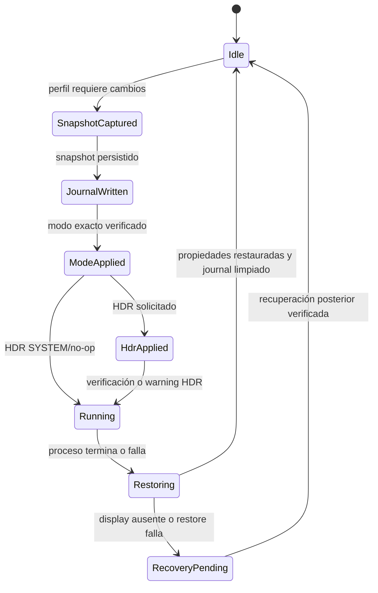

# Launch Display Profile V1

## Alcance

V1 aplica únicamente cambios de Windows al display seleccionado antes de
lanzar un juego y restaura el snapshot exacto al terminar. No modifica
configuración de GPU, DLSS, FSR, XeSS, Frame Generation, Lossless Scaling,
RTX HDR, Auto HDR ni archivos de configuración del juego.

El flujo es:

`DisplayProfile` → `LaunchDisplayOrchestrator` → `DisplayService` → Windows

El orchestrator se ejecuta dentro del lifecycle existente de `game_session`;
no mantiene un polling paralelo.

## Perfil persistente

`game_display_profiles` conserva una fila por `game_id` y usa modos forward-only:

- `resolutionMode`: `SYSTEM` o `CUSTOM`.
- `refreshRateMode`: `SYSTEM` o `CUSTOM`.
- `hdrMode`: `SYSTEM`, `OFF`, `ON` o `AUTO`.

`SYSTEM` no llama a Windows para ese atributo. Los defaults son todos
`SYSTEM`. La migración 31 convierte perfiles legacy habilitados con valores
de resolución/frecuencia a `CUSTOM`; no elimina datos ni reescribe historial.

## Estado y journal

Antes de cualquier mutación el orchestrator lee el display indicado de forma
estricta y captura:

`displayId`, `width`, `height`, `refreshRate`, `hdrEnabled`, `capturedAt`.

Después escribe `pending_display_profile_restore` y sólo entonces aplica el
modo. El journal contiene además `sessionId`, `gameId` y flags de qué
propiedades cambiaron. Su única fila se comporta como un mutex persistente:
una segunda sesión de display profile es rechazada.

## Aplicación

1. Se exige `displayId`; nunca se sustituye por otro monitor.
2. Se valida el triple exacto de modo contra los modos expuestos por Windows.
3. Se escribe el journal.
4. Se aplica resolución/frecuencia y se verifica el readback.
5. Se aplica HDR y se verifica el readback.

Si `ON` no está soportado, no se llama a enable y se devuelve un warning; el
lanzamiento puede continuar si el modo de display válido ya quedó aplicado.
`AUTO` sólo usa una recomendación determinista de HDR nativo (`Native` u
`Off`/`AlternativeAvailable`); con recomendación ausente o ambigua no cambia
HDR y deja evidencia de la advertencia.

En V1.1 esa recomendación se calcula durante el launch desde evidencia y
overrides persistidos de `GameCapabilities`, la caché de `HardwareCapabilities`
y el estado/modes actuales de `DisplayService`. Este camino es síncrono y no
consulta PCGamingWiki; por tanto un launch warm no genera HTTP. `SYSTEM` y
`ON/OFF` no consultan la recomendación.

## Restauración y crash recovery

Al salir, fallar o cancelarse la sesión, se restauran sólo los flags marcados:
modo exacto si cambió resolución/frecuencia y HDR si cambió HDR. Si ya coincide
con el snapshot no se escribe de nuevo. El snapshot original gana incluso si
el usuario cambió el display mientras el juego estaba abierto.

Al arrancar LumaDeck se intenta recuperar el journal. Si el display no existe
o el readback no coincide, el journal se conserva y no se aplica ningún otro
display. La recuperación es idempotente.

## Política de fallo y limitaciones

- Un modo no soportado bloquea el lanzamiento; no hay aproximación silenciosa.
- Fallos de HDR se reportan como warning y el journal permanece disponible para
  la restauración.
- `ALTERNATIVE_AVAILABLE` mantiene Windows HDR apagado y genera warning; no se
  ejecuta ningún workaround.
- V1 no selecciona automáticamente recomendaciones de resolución/frecuencia;
  el perfil por juego debe declarar esos valores explícitamente.
- V1 no interpreta workarounds de HDR ni Frame Generation. `AUTO` no activa
  alternativas de software.
- La UI se aloja en Details y usa el Navigation Engine existente para teclado,
  gamepad y mouse.

## Diagnóstico Win32 y fallback

`DisplayService` conserva el `DEVMODEW` real obtenido de
`EnumDisplaySettingsExW` para el mismo device name. No reconstruye
`dmSize`, `dmDriverExtra`, `dmBitsPerPel`, `dmDisplayOrientation` ni
`dmFields`; sólo selecciona por el triple exacto de ancho, alto y
`dmDisplayFrequency`. El diagnóstico registra device name, índice enumerado,
bits por pixel, frecuencia, orientación y `dmFields` hexadecimal.

Antes del apply se puede ejecutar el self-test `current → current` mediante
`test_current_display_mode`. Si el driver devuelve `DISP_CHANGE_FAILED (-1)`,
se marca `DISPLAY_API_TEST_UNAVAILABLE`; no se interpreta como modo no
soportado. Para un modo exacto previamente enumerado se conserva `CDS_TEST` y
sólo en ese caso se intenta el apply temporal directo. El readback exacto sigue
siendo obligatorio y el journal existente proporciona rollback.

En la máquina de QA actual, el display virtual `CDD` devolvió:

- current → current `CDS_TEST`: `-1` (`DISPLAY_API_TEST_UNAVAILABLE`);
- refresh alternativo: `CDS_TEST=-1`, fallback `-1`;
- resolución diferente: `CDS_TEST=-1`, fallback `-1`;
- combinado: `CDS_TEST=-1`, fallback `-1`;
- HDR soportado reportado, pero enable devolvió `DISPLAY_HDR_APPLY_FAILED:5`.

Cada caso verificó que el modo/HDR original permaneciera intacto. Esto
identifica la limitación del driver virtual del entorno, pero no demuestra aún
un cambio físico exitoso en un monitor real.
